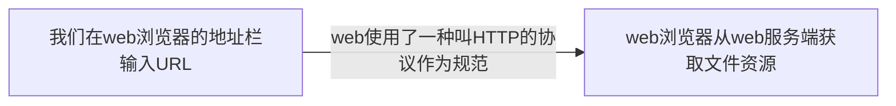

### web以及网络基础

>HTTP:  HyperText Transfer Protocol，超文本传输协议
>
>WWW: World Wide Web 万维网
>
>URL: Uniform Resource Locator 统一资源定位符
>
>通过发送请求获取服务器资源（resource）的web浏览器等，等可以称做客户端（client）；
>
>我们可以理解web是建立在HTTP上通信的；

### TCP/IP基础

HTTP基本属于TCP/IP的一个子集；

>TCP/IP是分层的：
>
>​	应用层，传输层，网络层 和 数据链路层
>
>应用层：
>
>​	应用层决定了向用户提供服务时候的通信活动；
>
>​	TCP/IP中的 FTP（File Transfer Protocol, 文件传输协议）和 DNS（Domain Name System， 域名系统）就是其中两类。
>
>​	HTTP也属于其中；
>
>传输层：
>
>​	传输层对上层应用层，提供了处于网络连接中的两台计算机之间的数据传输；
>
>​	在传输层有两个性质不用的协议： TCP（Transmission Control Protocol， 传输控制协议）和 UDP（User Data Protocol，用户数据报协议）；
>
>网络层：
>
>​	网络层用来处理网络上流动的数据包；
>
>​	数据包是网络传输的最小单位；
>
>​	该层规定了通过怎样的路径（传输路线）到达对方的计算机，并且把数据包给对方；
>
>链路层：
>
>​	用来处理连接网络的硬件部分；
>
>​	包括控制操作系统，硬件的驱动，NIC（网卡）等物理可见部分；
>
>​	硬件上的范畴均在链路层的作用范围内；

当我们利用TCP/IP通信的时候，，会通过分层顺序与对方进行通信。发送端从应用层往下，接收端从链路层往上。

在传输中，传输层会把从应用层接收到的数据（HTTP报文）进行分割，并且在各个报文打上标记号和端口号转发给网络层；在网络层，会增加作为通信目的地的MAC地址后转发给链路层。

### IP、 TCP 和 DNS

##### 负责传输的IP协议

按照层次划分，IP（Internet Protocol， 网际协议）属于网络层

>IP协议主要负责的是：把各种数据包传给对方。
>
>如果要保证确定传送到对方那里，还需要满足很多条件，其中最重要的就是<code>IP地址和MAC地址</code>.
>
>IP地址：被节点分配到的地址；
>
>MAC地址： 网卡的所属固定地址；
>
>IP地址可以跟MAC地址进行配对，IP地址经常可变，但是MAC地址基本不会变；

##### 利用APR协议凭借MAC地址通信

>IP间的通信依赖MAC地址；
>
>但是很少有双方计算机在同一个局域网下面；经常或通过多个计算机中转才会连接到对方；
>
>在进行中转的时候，会利用下一个中转的MAC地址来搜索下一个中转的目标；
>
>这个时候就回使用<strong>APR（Address Resolution Protocol）协议</strong>;
>
>ARP是一种解析地址的协议，可以根据通信的IP地址就可以反查出对应的MAC地址；

##### 确保可靠性的TCP

>按照层次分，TCP是属于传输层，提供字节流服务；
>
>字节流服务（Byte Stream Service）： 是为了方便传输，将大块数据分割成报文段为单位的数据包发送给对方;
>
><strong>简言之：TCP可以为了更容易传输，将大数据分割传送；而且TCP可以确定数据是否送达搭配对方。</strong>

##### 确保数据能到达对方

为了确定数据能无误的送到对方，TCP采用了三次握手（Three-way handshaking）：

>SYN（synchronize）, ACK（acknowledgegement）
>
>1. 发送端会发送一个带有SYN标志的数据包给对方；
>2. 接收端收到后会回传一个带有SYN/ACK的标志数据包以表达确定信息；
>3. 最后发送端在发送一个带有ACK的数据包，代表握手结束；

<strong>如果传输某个阶段莫名中断，那么TCP协议会再次以相同的顺序发送相同的数据包；</strong>

##### 负责域名解析的DNS

DNS（Domain Name System）服务适合HTTP协议一样位于应用层的协议；它提供了域名到IP之间的解析服务；

>DNS不仅可以解析域名到IP的服务，也可以反查IP到域名的服务；

##### 各种服务与HTTP之间的关系

##### URL和URI

>URL： Uniform Resource Locator， 统一资源定位符
>
>URI：Uniform Resource Identifier，统一资源标识符
>
>Uniform： 采用统一的方式处理不同类型的资源；（采用Http时候，就是使用的http， 还有其他协议方案：ftp，file等）
>
>Resource： 可标识的任何东西；
>
>Identifier：标识可标识的对象；

URI表示了某一互联网上资源， 而URL表示了该资源的地点；所以URL是URI的子集；

转述<a href="https://www.zhihu.com/question/21950864/answer/154309494">知乎大佬们</a>的回答：

身份证号码是人的唯一标识，那么URI就相当于身份证号码；通过身份证号码就可以定位到这个人，但是我们也可以通过地点定位到这个人，//地球/亚洲/中国/四川/成都/XX市/XXX.人，那么URL就相当于这个定位。

但是实际上URI不仅仅是一个号码，它包含了比较全面的信息，登录信息，服务器地址，服务器端口号（可以是域名这种可解析的也可以是IPv4），带层次的文件路径，查询的字符串，片段标识符等
